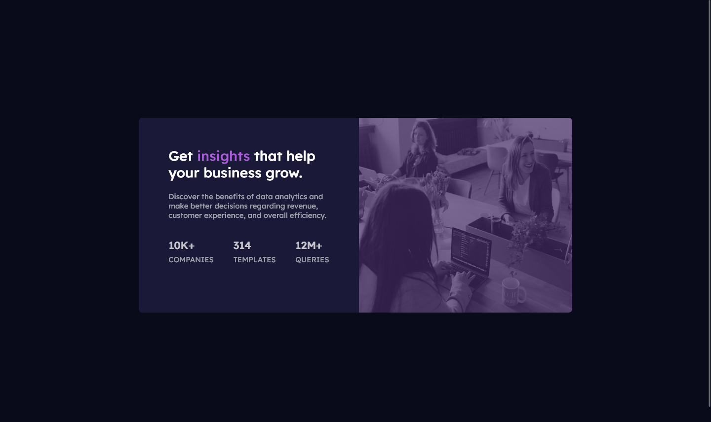
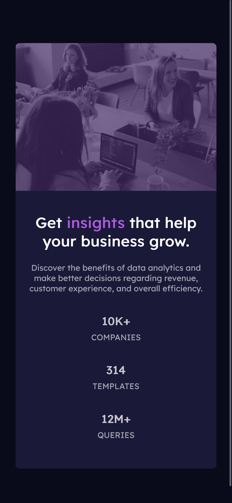

# Frontend Mentor - Stats preview card component solution

This is a solution to the [Stats preview card component challenge on Frontend Mentor](https://www.frontendmentor.io/challenges/stats-preview-card-component-8JqbgoU62). Frontend Mentor challenges help you improve your coding skills by building realistic projects.

## Table of contents

- [Overview](#overview)
  - [The challenge](#the-challenge)
  - [Screenshot](#screenshot)
  - [Links](#links)
- [My process](#my-process)
  - [Built with](#built-with)
  - [What I learned](#what-i-learned)
  - [Continued development](#continued-development)
  - [Useful resources](#useful-resources)
- [Author](#author)
- [Acknowledgments](#acknowledgments)

**Note: Delete this note and update the table of contents based on what sections you keep.**

## Overview

### The challenge

Users should be able to:

- View the optimal layout depending on their device's screen size

### Screenshots

#### Desktop



#### Mobile



### Links

- Solution URL: [Frontend Mentor](https://www.frontendmentor.io/solutions/frontend-mentor-stats-preview-card-component-solution-C63X1y5a3m)
- Live Site URL: [GitHub Pages](https://codedbychavez.github.io/stats-preview-card-component/)

## My process

### Built with

- Semantic HTML5 markup
- CSS custom properties
- Flexbox
- Mobile-first workflow

### What I learned

The major thing I learnt during this challenge is how to use media queries. This was something I struggled with and this challenge has presented the opportunity to use and understand it.

Here is how it was used to complete the challenge:

```css
/* 600px and above */
@media (min-width: 650px) {
  .card {
    display: flex;
    flex-direction: row-reverse;
    max-width: 65em;
  }

  .card__image {
    width: 100%;
    border-radius: 0px;
    border-top-right-radius: 0.5em;
    border-bottom-right-radius: 0.5em;
  }

  .card__text {
    padding: 4em;
    text-align: left;
    width: 60%;
  }

  .card__stats {
    display: flex;
    flex-wrap: wrap;
    justify-content: space-between;
  }
}
```

### Continued development

My next aim is to do similar challenges to practice media queries.

### Useful resources

- [The 100% correct way to do CSS breakpoints](https://www.freecodecamp.org/news/the-100-correct-way-to-do-css-breakpoints-88d6a5ba1862/) - This helped me picked the right break point to use reason. I really liked this pattern and will use it going forward.
- [Conquering Responsive Layout](https://courses.kevinpowell.co/view/courses/conquering-responsive-layouts) - This has helped me to learn and use flexbox.

## Author

- Website - [Chavez Harris](https://www.codedbychavez.com)
- Frontend Mentor - [@codedbychavez](https://www.frontendmentor.io/profile/yourusername)

## Acknowledgments

Hats off to [Frontendmentor.io](https://www.frontendmentor.io) for making this challenge possible. Special thanks to Kevin Powell for making this awesome [21-day challenge](https://courses.kevinpowell.co/view/courses/conquering-responsive-layouts) on responsive layouts.
